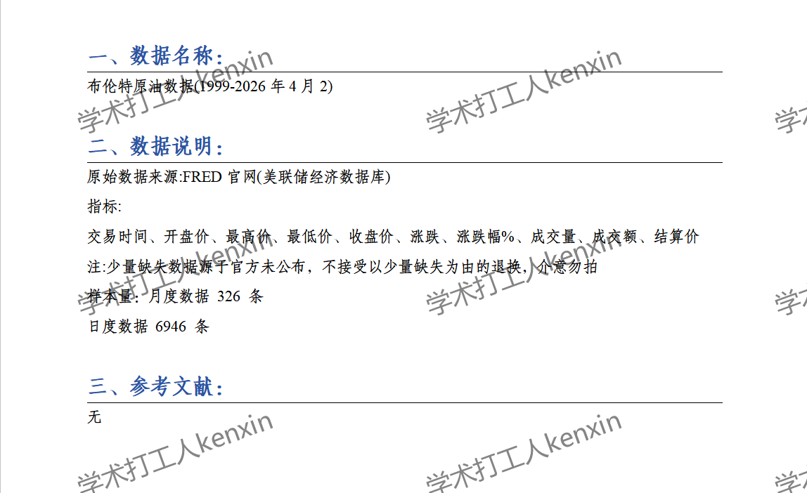
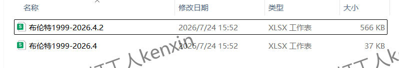
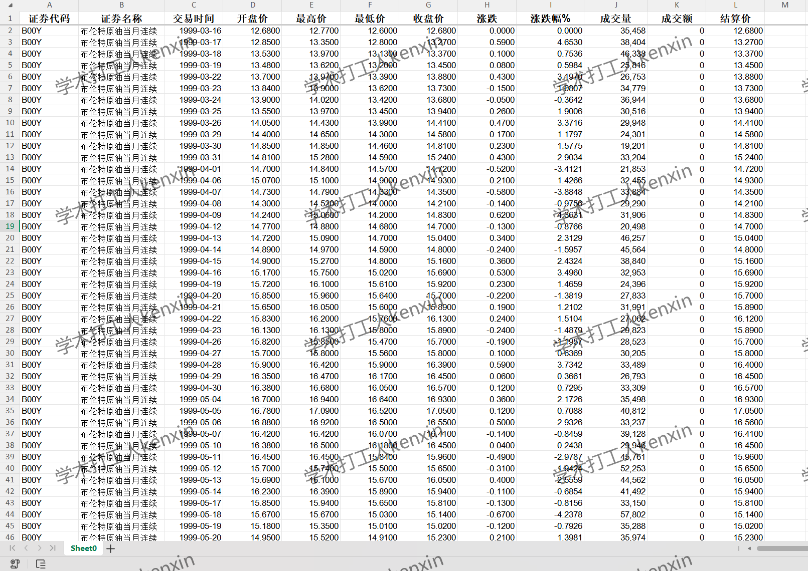
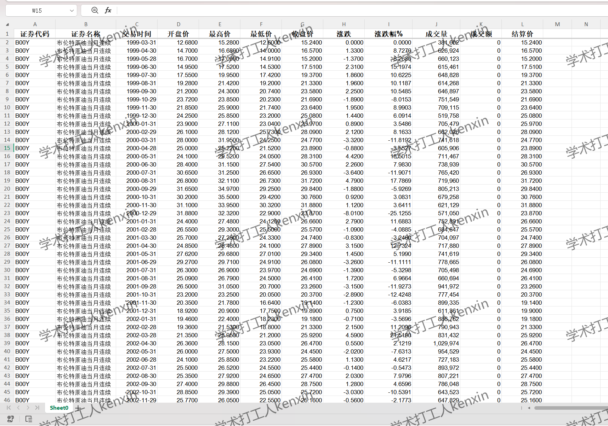

## Body

Brent Crude Oil Data (1999-2026 April 2)

After the purchase, no reason can be refunded without justification. There may be missing values; please check before purchasing or ask clearly before buying! Note: A small number of missing data is due to official undisclosed information, and returns or exchanges based on a small number of missing values are not accepted. If you have any objections, do not purchase. The transaction volume is all zero.

I. Data Introduction
(1) Data Details: See the image below for details. Please make sure to understand before purchasing! The displayed explanation is clear, please confirm whether it is what you need before placing the order. If there are any questions, please clarify before buying! No returns or exchanges will be accepted for any reason after shipment. Please confirm that you will use it before purchasing, and do not provide answers without questioning. Code reproduction requires a certain level of professionalism and may require specific device performance, so it is not guaranteed to reproduce. If you have any objections, please do not purchase! There may be missing values due to objective reasons, if you have any objections, please do not purchase, thank you!
(2) Data Name: Brent Crude Oil Data
(3) Sample Number: Monthly data 326 items
Daily data 6946 items
(4) Time Range: From 1999 to April 2, 2026
(5) Data Result Format: Excel
(6) Data Content: Results

II. Data Result Indicators as shown in the figure
Transaction time, opening price, highest price, lowest price, closing price, change, percentage change, trading volume, transaction volume, settlement price

III. Method of Indicator Construction is None

IV. References are None

## Images

Here is a pay link on Stripe ( https://buy.stripe.com/3cs8yP7sY87d0vu9AB ). Please contact me lonlonago@foxmail.com after funding $89, and I will send you a complete data files , thank you!

